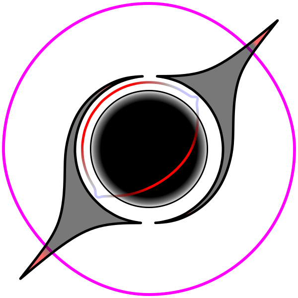

<p align="center">
  
</p>

<p align="center">
  
  
  
  
  <br>
  <h1 align="center">GeoTracing</h1>
  <h3>Python-библиотека для моделирования динамики частиц и визуализации эффектов Общей Теории Относительности</h3>
  <p>
    <strong>Гибридная архитектура (Python + OpenCL) • Высокопроизводительные вычисления • Релятивистская визуализация</strong>
  </p>
</p>

---

## 📖 Оглавление
- [✨ Особенности](#-особенности)
- [⚙️ Установка](#️-установка)
- [🖼️ Визуализации](#️-визуализации)
- [📄 Лицензия](#-лицензия)

---

## 📌 Описание

**GeoTracing** — это инструмент для численного моделирования движения частиц в искривлённом пространстве-времени. Библиотека позволяет:
- Интегрировать геодезические уравнения (в Гамильтоновом формализме) для массивных и безмассовых частиц.
- Выполнять трассировку лучей для визуализации релятивистских эффектов (гравитационное линзирование, тень чёрной дыры, кротовые норы).
- Работать с различными метриками пространства-времени (Шварцшильда, Керра, Эллиса–Бронникова и др.).

Библиотека реализована на Python с использованием **OpenCL** с оберткой **PyOpenCL** для ускорения вычислений на GPU/CPU.

---

## ✨ Особенности

- Поддержка нескольких метрик пространства-времени
- Гибридная архитектура: Python + OpenCL
- Высокая производительность за счёт параллельных вычислений
- Визуализация траекторий и релятивистских эффектов
- Кроссплатформенность
- При знании языка C/C++ и физики ОТО, возможно добавление произвольных метрик

---

## ⚙️ Установка

### 📋 Предварительные требования

- Python 3.9+
- Установленные драйверы OpenCL (обычно идут с видеодрайверами)
- Установленный компилятор OpenCL (например, от NVIDIA, AMD или Intel)

### 🔧 Установка драйверов

<details>
<summary><b>NVIDIA (CUDA)</b></summary>

1. Установите [CUDA Toolkit](https://developer.nvidia.com/cuda-downloads)
2. Проверьте установку: `nvidia-smi`
</details>

<details>
<summary><b>AMD</b></summary>

1. Установите [AMD GPU Drivers](https://www.amd.com/en/support)
2. Для OpenCL: [ROCm](https://rocm.docs.amd.com)
</details>

<details>
<summary><b>Intel</b></summary>

1. Установите [Intel OpenCL Driver](https://www.intel.com/content/www/us/en/developer/tools/opencl-sdk/overview.html)
</details>

### 📦 Установка GeoTracing

**Способ 1: Установка из PyPI (рекомендуется) (в процессе настройки)**
```bash
pip install geotracing
```

**Способ 2: Установка из исходного кода**
```bash
# Клонирование репозитория
git clone https://github.com/SkDen/GeoTracing.git
cd GeoTracing

# Установка зависимостей
pip install -r requirements.txt

# Установка в режиме разработки
pip install -e .
```
---
### 📁 Зависимости

```txt
Основные:
├── numpy>=2.0.2
├── pyopencl>=2024.2.7
└── matplotlib>=3.9.2

Дополнительные:
├── Pillow>=10.4.0          # Обработка изображений
├── opencv-python>=4.10     # Компьютерное зрение
├── tqdm>=4.66.5            # Индикаторы прогресса
└── memory-profiler>=0.61   # Профилирование памяти
```

---

## 🖼️ Визуализации

### 🎬 Демонстрация работы

<div align="center">
  <td align="center">
          
          <br>
          <strong>Анимация, созданная путём соединения множества смоделированных кадров</strong>
  </td>
</div>

### Сравнение метрик пространства-времени

<div align="center">
  <table>
    <tr>
      <td align="center">
        
        <br>
        <strong>а) Плоское пространство-время</strong>
      </td>
      <td align="center">
        
        <br>
        <strong>б) Метрика Шварцшильда</strong>
      </td>
      <td align="center">
        
        <br>
        <strong>в) Метрика Керра-Ньюмена</strong>
      </td>
      <td align="center">
        
        <br>
        <strong>г) Метрика Эллиса-Бронникова</strong>
      </td>
    </tr>
  </table>
  
  *Рис. 1: Трассировка световых лучей в различных метриках пространства-времени*
</div>

---

## Физика и математика моделирования

Библиотека **GeoTracing** реализует численное моделирование динамики частиц и света в искривлённом пространстве-времени в рамках **Общей Теории Относительности (ОТО)**. Основу моделирования составляют **геодезические уравнения**, описывающие движение свободных частиц и световых лучей в заданной метрике.

### Лагранжев и гамильтонов формализм

В ОТО движение свободной частицы или фотона описывается геодезическими уравнениями. Существуют два эквивалентных подхода к их записи и численному решению: **лагранжев** и **гамильтонов** формализм.

#### Лагранжев формализм
Уравнения геодезических в лагранжевой форме являются уравнениями второго порядка и включают в себя **символы Кристоффеля**, которые вычисляются через первые производные метрического тензора:

$$
\frac{d^2 x^\mu}{d\lambda^2} + \Gamma^\mu_{\alpha\beta} \frac{dx^\alpha}{d\lambda} \frac{dx^\beta}{d\lambda} = 0,
$$

где $x^\mu$ — координаты, $\lambda$ — аффинный параметр, а $\Gamma^\mu_{\alpha\beta}$ — символы Кристоффеля. Прямое интегрирование этой системы может быть вычислительно затратным из-за необходимости расчёта символов Кристоффеля на каждом шаге, а также потенциально менее устойчивым численно.

#### Гамильтонов формализм
Альтернативный подход использует **гамильтонов формализм**, который сводит задачу к системе уравнений первого порядка. Это повышает вычислительную эффективность и устойчивость интегрирования. Формализм вводит канонические импульсы $p_\alpha$ и функцию Гамильтона $H$.

**Гамильтониан** для частицы или фотона в произвольной метрике имеет вид:

$$
H(x^\alpha, p_\beta) = \frac{1}{2} g^{\mu\nu}(x^\alpha) p_\mu p_\nu,
$$

где $g^{\mu\nu}$ — контравариантные компоненты метрического тензора.

**Уравнения Гамильтона** записываются как:

$$
\frac{dx^\alpha}{d\lambda} = \frac{\partial H}{\partial p_\alpha}, \quad
\frac{dp_\alpha}{d\lambda} = -\frac{\partial H}{\partial x^\alpha}.
$$

#### Сравнение подходов
- **Лагранжев формализм** непосредственно следует из принципа наименьшего действия и более наглядно связан с геометрией. Однако численное интегрирование уравнений второго порядка может требовать больше вычислительных ресурсов.
- **Гамильтонов формализм** удваивает количество уравнений (с 4 до 8 для одной частицы), но все они первого порядка. Ключевое преимущество — **отсутствие явного вычисления символов Кристоффеля**, что значительно ускоряет расчёты, особенно для сложных метрик. Это делает его предпочтительным для высокопроизводительных вычислений, например, при трассировке множества лучей.

### Трассировка лучей для визуализации

Для визуализации релятивистских эффектов (гравитационное линзирование, тени чёрных дыр, изображения через кротовые норы) используется метод **обратной трассировки лучей**:

1.  **Построение карты небесных сфер:** Каждому направлению $(\theta_{\text{cs}}, \phi_{\text{cs}})$ на локальном небе виртуальной камеры ставится в соответствие точка на одной из двух асимптотически плоских «небесных сфер», связанных с метрикой.
2.  **Интегрирование уравнений:** Из направления луча на небе камеры определяются начальные условия для канонических импульсов. Затем уравнения Гамильтона интегрируются **обратно во времени** от камеры до пересечения с одной из небесных сфер.
3.  **Построение изображения:** Цвет и яркость каждого пикселя изображения определяются по данным (например, звёздной карте) в найденной точке пересечения на небесной сфере.

### Численная реализация

В библиотеке используется **гибридный подход** для сочетания удобства и производительности:
-   **Python (высокий уровень):** Удобный интерфейс для задания метрик, управления параметрами симуляции, визуализации результатов.
-   **OpenCL (низкий уровень):** Высокопроизводительное параллельное интегрирование систем дифференциальных уравнений на GPU или многоядерных CPU для трассировки тысяч лучей одновременно.

**Ключевые особенности реализации:**
-   Поддержка задания произвольных метрик пространства-времени в аналитическом или численном виде.
-   Автоматическое вычисление необходимых компонент метрического тензора и их производных.
-   Использование устойчивых методов интегрирования (например, Рунге-Кутты 4-го порядка) с адаптивным выбором шага.
-   Корректная обработка координатных особенностей (например, полюсов в сферических координатах).

### Базовые метрики пространства-времени

Библиотека поддерживает работу с произвольными метриками. В качестве фундаментальных примеров реализованы:

1.  **Метрика Минковского** (плоское пространство-время специальной теории относительности):

$$
ds^2 = -c^2 dt^2 + dx^2 + dy^2 + dz^2.
$$

2.  **Метрика Шварцшильда** (статическая, сферически симметричная чёрная дыра массы $M$):

$$
ds^2 = -\left(1 - \frac{2GM}{c^2 r}\right) c^2 dt^2 + \left(1 - \frac{2GM}{c^2 r}\right)^{-1} dr^2 + r^2 d\Omega^2.
$$

3.  **Метрика кротовой норы Эллиса** (простая статическая проходимая кротовая нора с горловиной радиуса $a$):

$$
ds^2 = -c^2 dt^2 + d\ell^2 + (\ell^2 + a^2) d\Omega^2,
$$

где координата $\ell$ пробегает значения от $-\infty$ до $+\infty$, соединяя две вселенные.

### Нормировка и сохраняющиеся величины

Тип геодезической определяется **условием нормировки** 4-скорости или 4-импульса:

$$
g_{\mu\nu} \frac{dx^\mu}{d\lambda} \frac{dx^\nu}{d\lambda} = \epsilon,
$$

где:
-   $\epsilon = -1$ — **времениподобная** геодезическая (массивная частица, $\lambda$ — собственное время $\tau$),
-   $\epsilon = 0$ — **светоподобная (нулевая)** геодезическая (фотон),
-   $\epsilon = +1$ — **пространственноподобная** геодезическая.

Для метрик с определёнными симметриями существуют **сохраняющиеся величины**, упрощающие анализ:
-   **Энергия:** $E = -p_t$ (связана с неизменностью метрики во времени).
-   **Угловой момент:** $L_z = p_\phi$ (связан с аксиальной симметрией).
-   **Полный угловой момент** (для сферически симметричных метрик).

Эти величины также служат индикатором точности численного интегрирования.

### Практическое применение

Методы, реализованные в библиотеке, позволяют решать широкий круг задач релятивистской астрофизики и компьютерной графики:
1.  Моделирование траекторий тел и аккреционных потоков в сильных гравитационных полях.
2.  Визуализация и количественный анализ эффектов **гравитационного линзирования**.
3.  Построение реалистичных изображений **аккреционных дисков** вокруг чёрных дыр.
4.  Моделирование наблюдений **кротовых нор** и изучение влияния их параметров (радиус горловины, длина) на оптические искажения.
5.  Создание образовательных материалов, наглядно демонстрирующих эффекты ОТО.

### Пример расчета для Гамильтонова формализма

Рассмотрим применение гамильтонова формализма для вычисления геодезических в метрике Шварцшильда. Исходная метрика в сферических координатах $(t, r, \theta, \phi)$:

$$
ds^2 = -\left(1 - \frac{r_s}{r}\right) dt^2 + \left(1 - \frac{r_s}{r}\right)^{-1} dr^2 + r^2(d\theta^2 + \sin^2\theta \, d\phi^2)
$$

где $r_s = 2GM/c^2$, и мы используем геометризованные единицы ($G = c = 1$).

#### Шаг 1: Гамильтониан
Сначала находим контравариантные компоненты метрического тензора $g^{\mu\nu}$:

$$
g^{tt} = -\left(1 - \frac{r_s}{r}\right)^{-1}, \quad
g^{rr} = \left(1 - \frac{r_s}{r}\right), \quad
g^{\theta\theta} = \frac{1}{r^2}, \quad
g^{\phi\phi} = \frac{1}{r^2\sin^2\theta}
$$

Гамильтониан (выражение через канонические импульсы $p_\mu$):

$$
H = \frac{1}{2} g^{\mu\nu} p_\mu p_\nu = \frac{1}{2} \left[ -\left(1 - \frac{r_s}{r}\right)^{-1} p_t^2 + \left(1 - \frac{r_s}{r}\right) p_r^2 + \frac{1}{r^2} p_\theta^2 + \frac{1}{r^2\sin^2\theta} p_\phi^2 \right]
$$

#### Шаг 2: Уравнения Гамильтона
Уравнения Гамильтона имеют стандартный вид:

$$
\frac{dx^\mu}{d\lambda} = \frac{\partial H}{\partial p_\mu}, \quad \frac{dp_\mu}{d\lambda} = -\frac{\partial H}{\partial x^\mu}
$$

где $\lambda$ — аффинный параметр.

#### Шаг 3: Сохраняющиеся величины
Поскольку метрика не зависит от $t$ и $\phi$, соответствующие импульсы сохраняются:

$$
\frac{dp_t}{d\lambda} = 0 \quad \Rightarrow \quad p_t = -E = \text{const} \quad (\text{энергия})
$$

$$
\frac{dp_\phi}{d\lambda} = 0 \quad \Rightarrow \quad p_\phi = L_z = \text{const} \quad (\text{z-компонента углового момента})
$$

Для сферически симметричной метрики также сохраняется полный угловой момент:

$$
L^2 = p_\theta^2 + \frac{p_\phi^2}{\sin^2\theta}
$$

#### Шаг 4: Уравнения движения для координат
Вычисляем уравнения для координат:

$$
\frac{dt}{d\lambda} = \frac{\partial H}{\partial p_t} = -\left(1 - \frac{r_s}{r}\right)^{-1} p_t
$$

$$
\frac{dr}{d\lambda} = \frac{\partial H}{\partial p_r} = \left(1 - \frac{r_s}{r}\right) p_r
$$

$$
\frac{d\theta}{d\lambda} = \frac{\partial H}{\partial p_\theta} = \frac{p_\theta}{r^2}
$$

$$
\frac{d\phi}{d\lambda} = \frac{\partial H}{\partial p_\phi} = \frac{p_\phi}{r^2\sin^2\theta}
$$

#### Шаг 5: Уравнения для импульсов (кроме сохраняющихся)
Для $p_r$ и $p_\theta$:

$$
\frac{dp_r}{d\lambda} = -\frac{\partial H}{\partial r} = -\frac{1}{2} \left[ \frac{r_s}{r^2} \left(1 - \frac{r_s}{r}\right)^{-2} p_t^2 - \frac{r_s}{r^2} p_r^2 - \frac{2}{r^3} \left( p_\theta^2 + \frac{p_\phi^2}{\sin^2\theta} \right) \right]
$$

$$
\frac{dp_\theta}{d\lambda} = -\frac{\partial H}{\partial \theta} = \frac{p_\phi^2 \cos\theta}{r^2\sin^3\theta}
$$

#### Шаг 6: Условие нормировки
Тип геодезической определяется условием:

$$
g_{\mu\nu} \frac{dx^\mu}{d\lambda} \frac{dx^\nu}{d\lambda} = \epsilon
$$

где:
- $\epsilon = -1$ — времениподобные геодезические (массивные частицы)
- $\epsilon = 0$ — светоподобные геодезические (фотоны)

Это условие эквивалентно $H = \epsilon/2$. Для фотонов получаем $H = 0$, что даёт дополнительное уравнение связи.

#### Шаг 7: Редукция для экваториальной плоскости
Для движения в экваториальной плоскости ($\theta = \pi/2$, $p_\theta = 0$) уравнения упрощаются. Уравнение для $p_r$ принимает вид:

$$
\frac{dp_r}{d\lambda} = -\frac{1}{2} \left[ \frac{r_s}{r^2} \left(1 - \frac{r_s}{r}\right)^{-2} p_t^2 - \frac{r_s}{r^2} p_r^2 - \frac{2}{r^3} p_\phi^2 \right]
$$

Условие нормировки для массивной частицы ($\epsilon = -1$):

$$
-\left(1 - \frac{r_s}{r}\right)^{-1} \left(\frac{dt}{d\lambda}\right)^2 + \left(1 - \frac{r_s}{r}\right)^{-1} \left(\frac{dr}{d\lambda}\right)^2 + r^2 \left(\frac{d\phi}{d\lambda}\right)^2 = -1
$$

Подставляя выражения через импульсы, получаем первый интеграл для радиального движения:

$$
\left(\frac{dr}{d\lambda}\right)^2 = E^2 - \left(1 - \frac{r_s}{r}\right)\left(1 + \frac{L_z^2}{r^2}\right)
$$

Для фотонов аналогично:

$$
\left(\frac{dr}{d\lambda}\right)^2 = E^2 - \left(1 - \frac{r_s}{r}\right)\frac{L_z^2}{r^2}
$$

#### Заключение
Гамильтонов формализм позволяет свести задачу к интегрированию системы восьми уравнений первого порядка, избегая явного вычисления символов Кристоффеля. Это повышает вычислительную эффективность, особенно при трассировке множества лучей, что критически важно для визуализации релятивистских эффектов.

---

## 📄 Лицензия

© 2024 Бухтуев Денис Андреевич

GeoTracing распространяется под лицензией Creative Commons Attribution-NonCommercial-ShareAlike 4.0 International (CC BY-NC-SA 4.0).

**Вы можете:**
- ✅ Использовать в некоммерческих целях
- ✅ Модифицировать и адаптировать
- ✅ Распространять при сохранении лицензии

**При условиях:**
- 📝 Указания авторства (обязательная ссылка на репозиторий)
- 🚫 Запрета коммерческого использования
- 🔄 Распространения производных работ под той же лицензией

Полный текст лицензии: [LICENSE](LICENSE)

---
