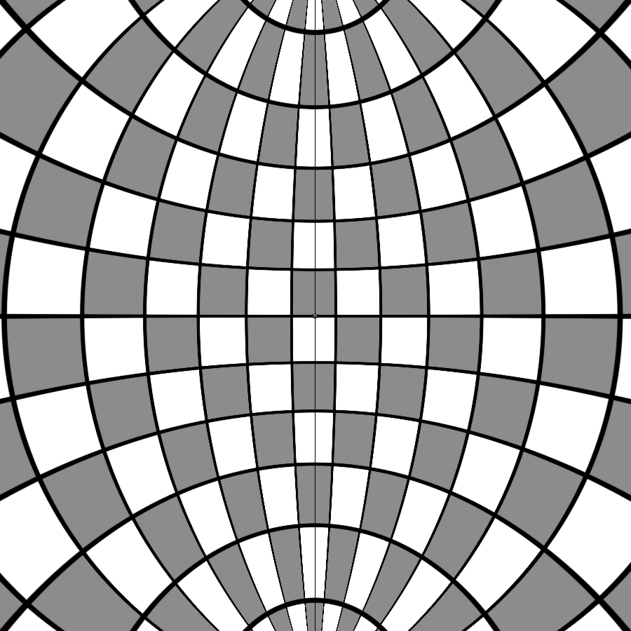
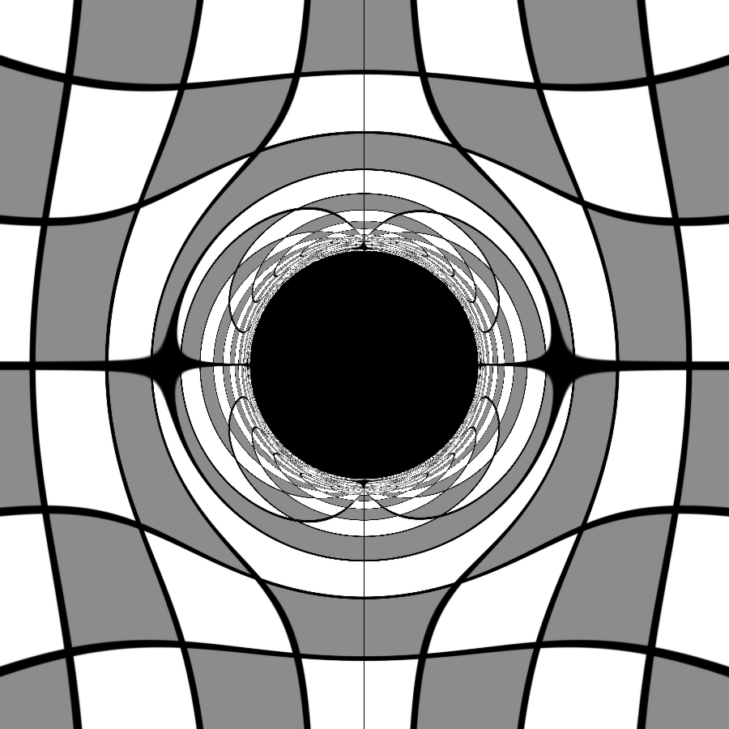
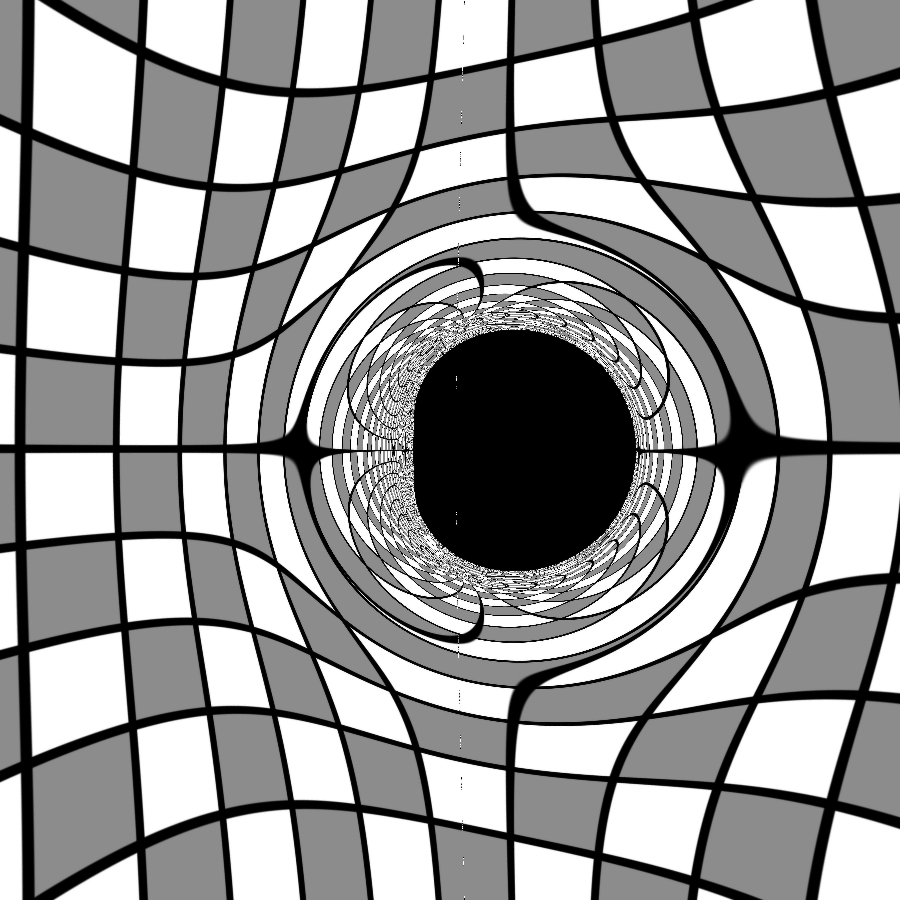
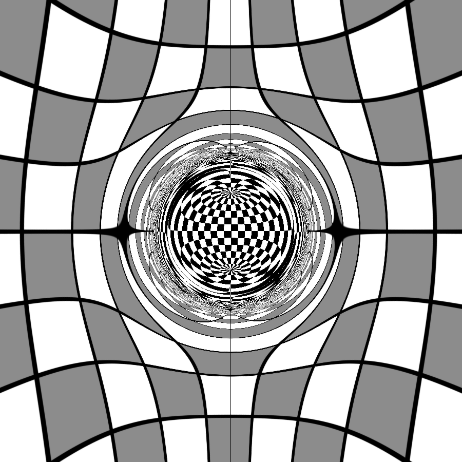

<p align="center">
  
  
  
  
  <br>
  <h1 align="center">GeoTracing</h1>
  <h3>Python-библиотека для моделирования динамики частиц и визуализации эффектов Общей Теории Относительности</h3>
  <p>
    <strong>Гибридная архитектура (Python + OpenCL) • Высокопроизводительные вычисления • Релятивистская визуализация</strong>
  </p>
</p>

---

## 📖 Оглавление
- [✨ Особенности](#-особенности)
- [⚙️ Установка](#️-установка)
- [🖼️ Визуализации](#️-визуализации)
- [📄 Лицензия](#-лицензия)

---

## 📌 Описание

**GeoTracing** — это инструмент для численного моделирования движения частиц в искривлённом пространстве-времени. Библиотека позволяет:
- Интегрировать геодезические уравнения (в Гамильтоновом формализме) для массивных и безмассовых частиц.
- Выполнять трассировку лучей для визуализации релятивистских эффектов (гравитационное линзирование, тень чёрной дыры, кротовые норы).
- Работать с различными метриками пространства-времени (Шварцшильда, Керра, Эллиса–Бронникова и др.).

Библиотека реализована на Python с использованием **OpenCL** с оберткой **PyOpenCL** для ускорения вычислений на GPU/CPU.

---

## ✨ Особенности

- Поддержка нескольких метрик пространства-времени
- Гибридная архитектура: Python + OpenCL
- Высокая производительность за счёт параллельных вычислений
- Визуализация траекторий и релятивистских эффектов
- Кроссплатформенность
- При знании языка C/C++ и физики ОТО, возможно добавление произвольных метрик

---

## ⚙️ Установка

### 📋 Предварительные требования

- Python 3.9+
- Установленные драйверы OpenCL (обычно идут с видеодрайверами)
- Установленный компилятор OpenCL (например, от NVIDIA, AMD или Intel)

### 🔧 Установка драйверов

<details>
<summary><b>NVIDIA (CUDA)</b></summary>

1. Установите [CUDA Toolkit](https://developer.nvidia.com/cuda-downloads)
2. Проверьте установку: `nvidia-smi`
</details>

<details>
<summary><b>AMD</b></summary>

1. Установите [AMD GPU Drivers](https://www.amd.com/en/support)
2. Для OpenCL: [ROCm](https://rocm.docs.amd.com)
</details>

<details>
<summary><b>Intel</b></summary>

1. Установите [Intel OpenCL Driver](https://www.intel.com/content/www/us/en/developer/tools/opencl-sdk/overview.html)
</details>

### 📦 Установка GeoTracing

**Способ 1: Установка из PyPI (рекомендуется)**
```bash
pip install geotracing
```

**Способ 2: Установка из исходного кода**
```bash
# Клонирование репозитория
git clone https://github.com/yourusername/geotracing.git
cd geotracing

# Установка зависимостей
pip install -r requirements.txt

# Установка в режиме разработки
pip install -e .
```
---
### 📁 Зависимости

```txt
Основные:
├── numpy>=2.0.2
├── pyopencl>=2024.2.7
└── matplotlib>=3.9.2

Дополнительные:
├── Pillow>=10.4.0          # Обработка изображений
├── opencv-python>=4.10     # Компьютерное зрение
├── tqdm>=4.66.5            # Индикаторы прогресса
└── memory-profiler>=0.61   # Профилирование памяти
```

---

## 🖼️ Визуализации

### 🎬 Демонстрация работы

<div align="center">
  <td align="center">
          
          <br>
          <strong>Анимация, созданная путём соединения множества смоделированных кадров</strong>
  </td>
</div>

### Сравнение метрик пространства-времени

<div align="center">
  <table>
    <tr>
      <td align="center">
        
        <br>
        <strong>а) Плоское пространство-время</strong>
      </td>
      <td align="center">
        
        <br>
        <strong>б) Метрика Шварцшильда</strong>
      </td>
      <td align="center">
        
        <br>
        <strong>в) Метрика Керра-Ньюмена</strong>
      </td>
      <td align="center">
        
        <br>
        <strong>г) Метрика Эллиса-Бронникова</strong>
      </td>
    </tr>
  </table>
  
  *Рис. 1: Трассировка световых лучей в различных метриках пространства-времени*
</div>

---

## 📄 Лицензия

© 2024 Бухтуев Денис Андреевич

GeoTracing распространяется под лицензией Creative Commons Attribution-NonCommercial-ShareAlike 4.0 International (CC BY-NC-SA 4.0).

**Вы можете:**
- ✅ Использовать в некоммерческих целях
- ✅ Модифицировать и адаптировать
- ✅ Распространять при сохранении лицензии

**При условиях:**
- 📝 Указания авторства (обязательная ссылка на репозиторий)
- 🚫 Запрета коммерческого использования
- 🔄 Распространения производных работ под той же лицензией

Полный текст лицензии: [LICENSE](LICENSE)

---

